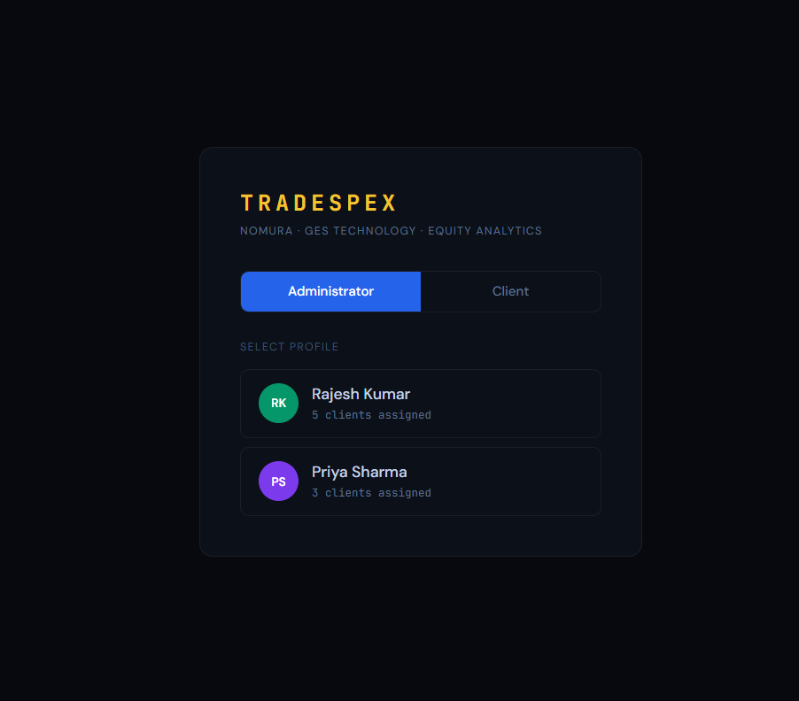
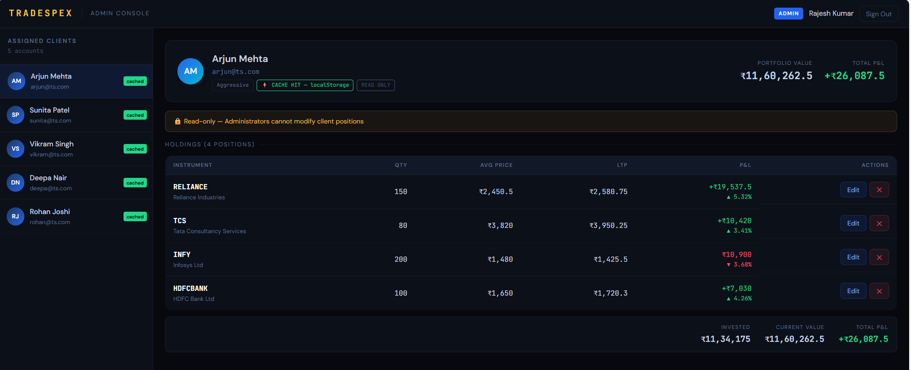
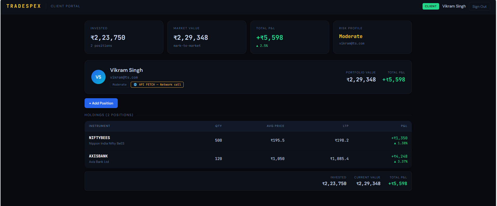

# tradeSpex







tradeSpex is a lightweight React + Vite web app for portfolio and stock management with a clean component-driven UX and Redux Toolkit state handling. It includes auth, portfolio data views, per-stock modals, and role-based dashboards (admin + client).

## 🚀 Key features

- React 18 + Vite
- Redux Toolkit slices (`auth`, `portfolio`)
- API service layer (`services/portfolioApi.js`) for backend integration
- Role-specific pages:
  - `AdminDashboard`
  - `ClientDashboard`
- Reusable UI components:
  - `Topbar`, `PortfolioTable`, `StockModal`
- Mock data support via `data/mockData.js`
- Tailwind + custom CSS

## 📁 Project structure

- `src/`
  - `app/` - Redux store setup (`store.js`)
  - `assets/` - static assets
  - `components/` - shared UI components (`PortfolioTable.jsx`, `StockModal.jsx`, `layout/Topbar.jsx`, `ui/index.jsx`)
  - `data/` - mock data and constants
  - `features/` - Redux feature slices (`auth/authSlice.js`, `portfolio/portfolioSlice.js`)
  - `pages/` - route pages (`LoginPage.jsx`, `AdminDashboard.jsx`, `ClientDashboard.jsx`)
  - `services/` - API client wrappers (`portfolioApi.js`)
  - `App.jsx`, `main.jsx`, `index.css`, `App.css`

## 🛠️ Prerequisites

- Node.js v16 or higher
- npm (or yarn/pnpm)

## ⚡ Setup

1. Clone the repo:

```bash
git clone https://github.com/<your-org>/tradeSpex.git
cd tradeSpex
```

2. Install dependencies:

```bash
npm install
# or
# yarn install
# pnpm install
```

3. Start development server:

```bash
npm run dev
# or
# yarn dev
# pnpm dev
```

4. Open browser at `http://localhost:5173` (default Vite URL).

## 🧪 Build and test

- Build production bundle:

```bash
npm run build
```

- Preview production build locally:

```bash
npm run preview
```

- Lint source files:

```bash
npm run lint
```

## 🔧 App workflow

1. User logs in at `LoginPage`.
2. Auth state is managed by `authSlice`.
3. Based on user role, one of `AdminDashboard` or `ClientDashboard` is displayed.
4. Portfolio state (`portfolioSlice`) is loaded/synced with `portfolioApi`.
5. `PortfolioTable` lists positions and `StockModal` shows details on demand.

## 🧩 Customization

- Add new slices under `src/features/`.
- Add endpoints in `src/services/portfolioApi.js`.
- Extend pages in `src/pages/` and route logic in `App.jsx`.

## 📚 Notes

- This repo is built from Vite React template and tailored for stock portfolio management.
- Replace mock data with real backend endpoints as needed.

## 👤 Contributing

- Fork and branch naming: `feature/<name>` or `fix/<name>`
- Open PR with tests and lint passing
- Ensure code formatting with Prettier and ESLint rules

## 🧾 License

- MIT (or choose your preferred license)

